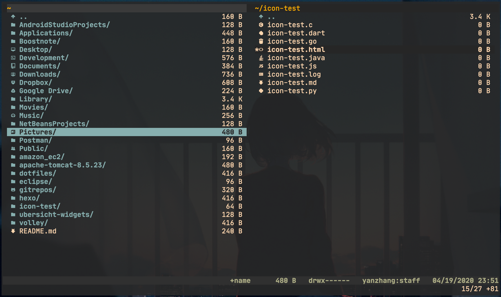

# Vifm file manager

## Icon setting

This icon setting is inspired by [ranger_devicons](https://github.com/alexanderjeurissen/ranger_devicons). It is very comprehensive,
containing icons for different filetype, special directories (like ~/Downloads, ~/Dropbox, etc), special files (like .vimrc), and relatively
complete file extensions. It has a great format so that you could add your own icons easily.

### Prerequisite

A font patched using [Nerd Fonts](https://github.com/ryanoasis/nerd-fonts) is required. And set it as the default font for your terminal.

I personally use the JetBrainsMono patched using Nerd Fonts as shown in the screenshot above.

### Installation

Append the code in the icons file into your vifmrc and restart vifm. Or download the icons file and append `source /path/to/icons` into your
vifmrc, and restart vifm.

**NOTE:** I have combined multiple `set classify` commands for avoding the sluggish startup.
